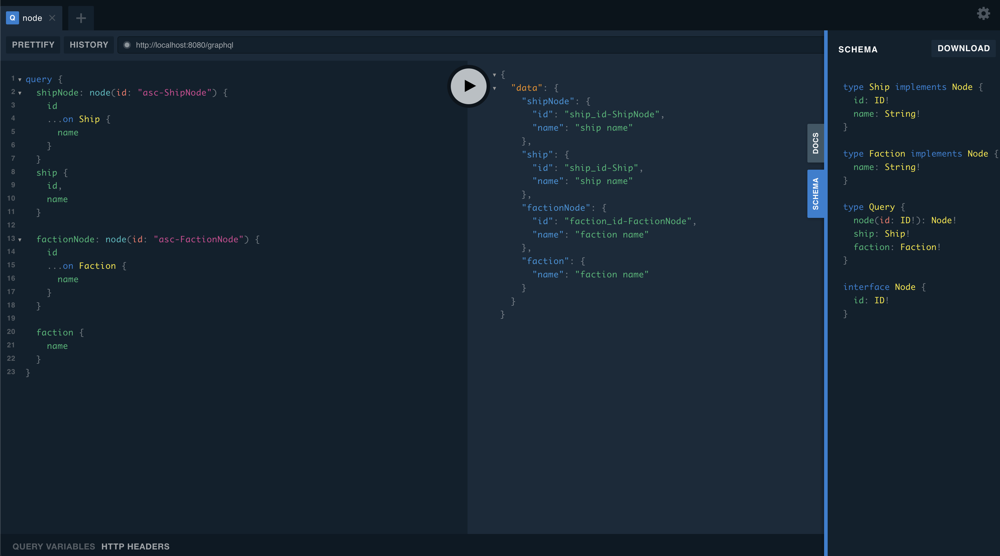

# juniper_interface_issue

Reproduction repository for [juniper issue](https://github.com/graphql-rust/juniper/issues/1161)

The repository implements the `Node` interface for both `Ship` and `Faction` and there are 3 queries `node`, `ship` and `faction`. The `Faction` model only implements the `id` resolver for `Node` but `Ship` model implements the `id` resolver for both `Node` and `self`.

In the schema result `Faction` doesn't have `id` definition so if you try to query with:

```graphql
query {
    faction {
        name
    }
}

```

You only can query the name because `id` doesn't exist in this case (because doesn't implement id for self) but you can have the `id` if you query by:

```graphql
query {
    factionNode: node(id: "asc-FactionNode") {
        id
        ...on Faction {
        name
        }
    }
}
```

For `Ship` it is diferent because `Ship` implements `id` for self so you can do:

```graphql
query {
	shipNode: node(id: "asc-ShipNode") {
        id
        ...on Ship {
            name
        }
    }
    ship {
        id,
        name
    }
}
```

The problem here is the result that the id from `node` come from the `Node implementation` and `ship` come from `Self implementation`.



## Expected result

I expect to have an implementation like `Faction` and you can retrieve the `id` in any query that uses `Faction` not just when it is used throw `Node`.


## Run server

Run `cargo run` in the root directory